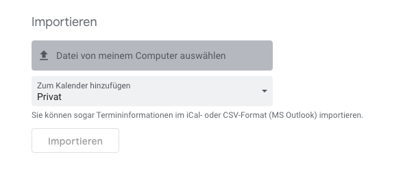

Abfallkalender St. Gallen ics generator
=======================================

# Installation
## Requirements
Installiere die Requirements

* [NodeJS](https://nodejs.org/en/download/)

Führe folgende Befehle auf der Konsole aus:

    git clone https://github.com/nicam/abfallkalender-sg
    cd abfallkalender-sg
    npm install

# Verwendung
    npm start -- REGION SAMMLUNGEN_KOMMA_SEPARIERT

## Beispiel
Erzeugen des Abfallkalenders für die Region `Lachen` für Karton, Papier und Altmetall

    npm start -- B Karton,Papier,Altmetall

## Mögliche Werte

### Region
Code | Region
---------- |---------------
A| 	Winkeln
B| 	Lachen
C| 	Rosenberg
D| 	Rotmonten
E| 	Bruggen/Riethüsli
F| 	St.Georgen/Notkersegg
G| 	Heiligkreuz
H| 	Stephanshorn
I| 	St.Fiden
K| 	Neudorf
L West|  	Innenstadt West
L Ost|  	Innenstadt Ost

### Sammlungen

* Karton
* Grüngut
* Kehricht
* Altmetall
* Karton

# Import in Google Kalender

* Öffne deinen Google Kalender unter => https://calendar.google.com/calendar/u/0/r/settings/export
* Wähle die generierte Datei aus
* Wähle den gewünschten Kalender aus
* Klick auf importieren

